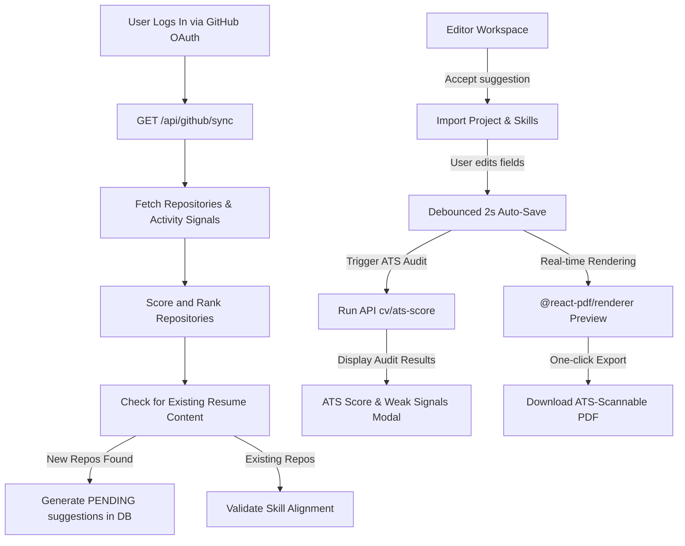
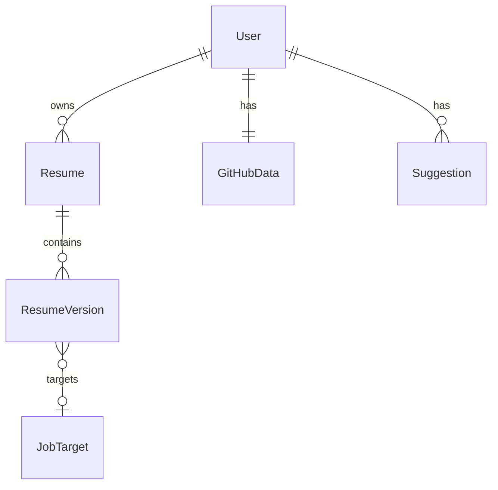

# 📄 RESUMMIT — Your Commits. Your Career.

**Resummit** is a developer-centric, AI-powered resume builder and intelligence workspace. It deep-syncs with your GitHub profile, analyzing repositories, commit frequency, language stacks, and repository README structures to transform your real-world coding contributions into professional, recruiter-ready resumes in real-time.

---

## 📸 Visual Showcase

### 🌟 Landing Page
The Resummit landing page presents a vibrant, developer-focused interface. It introduces the core value proposition: leveraging your existing GitHub contributions to generate clean, high-signal resume bullets instantly.


### 🛠️ Editor & Interactive Workspace
The workspace is split into an editable dashboard on the left—complete with interactive tabs for profile info, categorized skill grids, experience histories, project lists, and live achievements—and a real-time, print-ready PDF preview on the right.


---

## ⚡ Core Features

### 1. GitHub-Powered Resume Intelligence
* **Repo Scoring Engine**: Analyzes your public repositories and calculates a dynamic score based on stars, recent pushed-at activity, language distributions, and repository details to rank the professional impact of your projects.
* **Smart Sync (Background Cooldowns)**: Employs a sync throttle/cooldown mechanism to manage GitHub API rate limits, keeping local data refreshed without triggering lockout thresholds.

### 2. Gemini AI Integration (with Ollama Fallback)
* **Dual-Engine Design**: Primary AI tasks are handled by `gemini-2.0-flash`. If quota or rate limits are reached, the system gracefully falls back to a locally run Ollama `llama3.2` model, ensuring uninterrupted workspace reliability.
* **Auto-Generated Summaries**: Generates high-density, professional 2-sentence resume summaries based strictly on active skill categories and projects, avoiding generic buzzwords and adjectives.
* **High-Impact Bullet Refinement**: Rewrites experience and project highlight bullets using action-focused, past-tense verbs under a strict 18-word threshold.

### 3. ATS Scoring & Quality Auditing
* **Real-time Evaluation**: Evaluates resume versions against targeted job roles, generating a score breakdown across *Skills density*, *Project depth*, and *Outcome/Impact*.
* **Weak Signal Alerts**: Automatically scans for and flags structural errors like `SHORT_SUMMARY`, `REPETITIVE_VERBS` (starting bullets with the same verb), `LOW_SKILL_DENSITY`, or `NO_IMPACT_BULLETS` (bullets without logical or metric outcomes).
* **Actionable Improvements**: Suggests specific "Quick Fixes" and improvements directly within a premium modal audit.

### 4. Interactive Project Discoveries
* **New Project Detection**: Identifies repositories in your GitHub account that aren't yet on your resume and serves them up in a dedicated review feed.
* **Single-Click Import**: Seamlessly imports selected repositories, auto-extracting technical descriptions and achievements parsed from repository READMEs.

### 5. Smart Skills Validation
* **Verified vs. Unverified Status**: Cross-references listed resume skills against code structures in your active GitHub repositories to mark technologies as "Verified" or "Unverified."
* **Double-Categorization De-duplication**: Cleanses, categories, and normalizes skill listings across programming languages, libraries/frameworks, and development tools to ensure a cohesive technical grid.

### 6. Premium WYSIWYG & PDF Rendering
* **Experience Date Picker**: A custom-built date range picker that handles "Present" options, parses bounds dynamically, and validates inputs on-the-fly.
* **Split-screen Resizing**: Features a drag-and-resize sidebar separator allowing the user to customize their editor workspace layout from 380px to 800px wide.
* **Debounced Auto-Save**: Automatically saves workspace adjustments to the database with a 2-second debounce, backed by a `beforeunload` safe-check guard to ensure changes are never lost.
* **Export-Ready PDFs**: Uses `@react-pdf/renderer` to compile perfect, single-page, ATS-scannable resume sheets with the click of a button.

---

## 📐 System Workflow



---

## 🗄️ Database & Schema Specifications

The project uses **Prisma** to manage relationships in PostgreSQL (production) and SQLite (development).



* **`User`**: Core user profiles tracking linked social accounts, active roles, and general experience levels.
* **`Resume`**: Grouping entity that supports multiple specialized versions of a user's resume.
* **`ResumeVersion`**: Stores structured resume contents (personal info, skills, experience, projects, education, and achievements) as JSON, alongside metadata like ATS scores and tailoring targets.
* **`JobTarget`**: Captures targeted job descriptions pasted by users, tracking missing skills, keyword densities, and tailoring metrics.
* **`GitHubData`**: Caches up to 50 scored repositories and AI-inferred engineering signals. Keeps encrypted access tokens to fetch files like READMEs.
* **`Suggestion`**: Tracks interactive optimization suggestions (`NEW_PROJECT`, `IMPROVE_PROJECT`, `ADD_SKILL`) with priority rankings, confidence scores, and status flags (`PENDING`, `ACCEPTED`, `DISMISSED`).

---

## 🛠️ Tech Stack & Key Libraries

### Frontend
* **Framework**: [Next.js 16 (App Router)](https://nextjs.org/)
* **Runtime**: [React 19](https://react.dev/)
* **Styling**: [TailwindCSS v4](https://tailwindcss.com/)
* **Animations**: [Framer Motion](https://www.framer.com/motion/)
* **Icons**: [Lucide React](https://lucide.dev/)

### Backend & Infrastructure
* **ORM**: [Prisma ORM](https://www.prisma.io/)
* **Database**: PostgreSQL (Prisma Client + `pg`) / SQLite (`dev.db` locally)
* **Caching & Synchronizations**: [Upstash Redis](https://upstash.com/)
* **Auth**: [Next Auth v5 (Auth.js)](https://authjs.dev/)

### Resume & AI Intelligence
* **PDF Compiler**: [`@react-pdf/renderer`](https://react-pdf.org/)
* **AI Framework**: `@google/generative-ai` (Gemini 2.0 Flash)
* **Local Fallback LLM**: Ollama (`llama3.2`)

---

## 🚀 Local Installation & Setup

Follow these steps to spin up the Resummit development server locally:

### 1. Clone the repository and install dependencies
```bash
git clone https://github.com/dragon486/Sclade.git
cd Sclade
npm install
```

### 2. Configure Environment Variables
Create a `.env` file in the root directory. You can copy the template from `.env.example`:
```bash
cp .env.example .env
```

Ensure your `.env` contains the required keys:
```env
# Database Connections
DATABASE_URL="file:./dev.db" # SQLite local database or your Postgres connection

# Next Auth Configurations
AUTH_SECRET="your_next_auth_secret_key"
GITHUB_CLIENT_ID="your_github_oauth_client_id"
GITHUB_CLIENT_SECRET="your_github_oauth_client_secret"

# AI Integrations
GEMINI_API_KEY="your_gemini_api_key_here"

# Optional Local Fallback
OLLAMA_URL="http://localhost:11434"
OLLAMA_MODEL="llama3.2"
```

### 3. Initialize the Database Schema
Generate the client code and sync your database tables using Prisma:
```bash
npx prisma generate
npx prisma db push
```

### 4. Run the Development Server
```bash
npm run dev
```

Open [http://localhost:3000](http://localhost:3000) in your browser to explore the landing page and start tailoring your developer resume!

---

## 🛡️ License

This software is developed under private licensing terms. All rights reserved. Built with passion for developers aiming to build high-signal professional portfolios.
